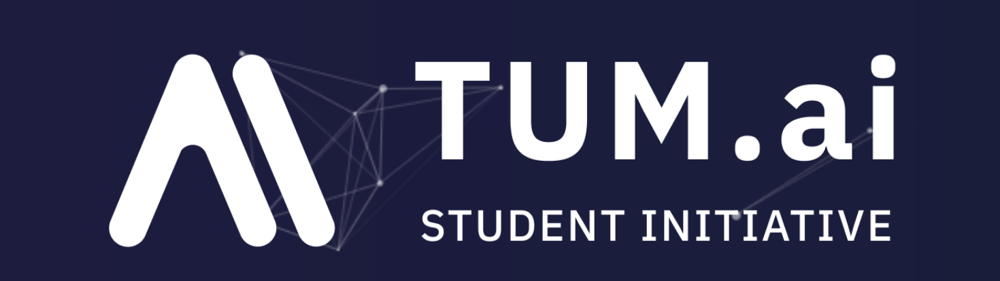

# AI Collection

---

This repository contains a collection of notebooks and links to other repos from past TUMai events. 

---

## Getting Started

The repo is organized by semesters. In each semester different events took place.

---

## Table of Contents 

- WS2223
  - ai-academy
    - Object Detection - Driveblocks
    - MLOps - ZenML
    - Reinforcement Learning - AppliedAI
  - bootcamp
    - pneumonia-classification.ipynb 

